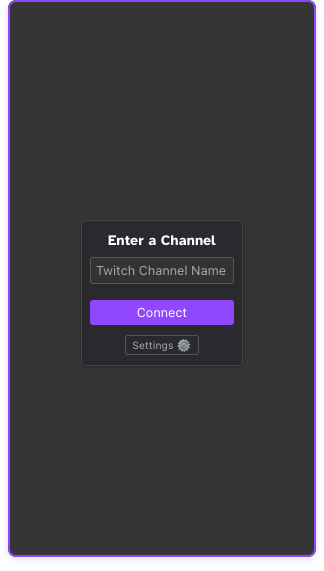
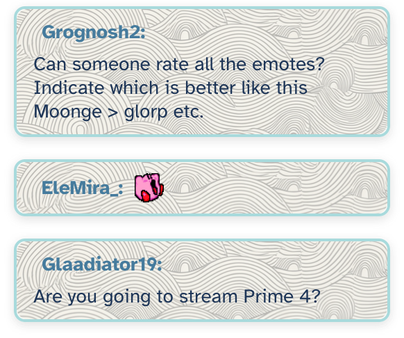
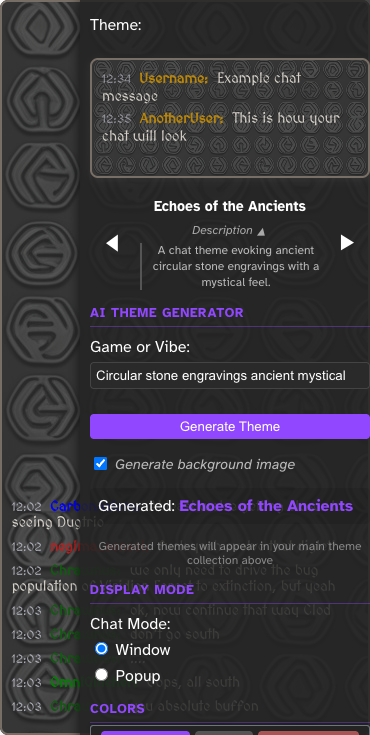
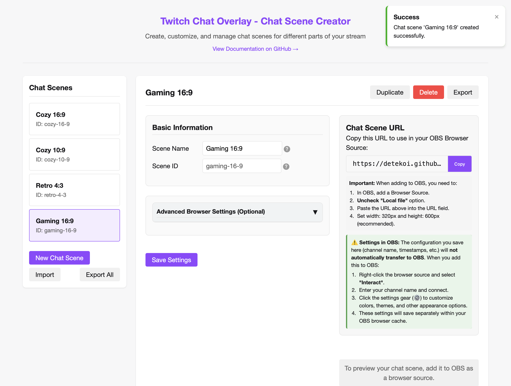

# Chat Overlay for Twitch and OBS

A lightweight, customizable Twitch chat overlay for streamers using OBS or other broadcasting software.

## AI Theme Generation with Background Images

- **AI-Generated Backgrounds**: Get unique background images that perfectly match your theme's aesthetic.
- **Theme Carousel**: Easily browse through all available themes with a visual preview carousel.
- **Enhanced Visual Editor**: Precise controls for opacity, border radius, and box shadows.
- **Initial Connection Guide**: Streamlined first-time setup with a helpful connection prompt.
- **Accessibility Considerations**: Disable background images for high contrast and better readability.

Simply describe any game, aesthetic, or mood (like `Minecraft`, `cyberpunk night city`, or `cozy forest vibes`), and the AI will generate a complete theme with perfectly matched colors, fonts, and background image!

## Try It Now

**[➜ Online Version](https://detekoi.github.io/compact-chat-overlay/)**

Create and manage multiple chat styles for all of your OBS scenes in seconds!

## Features

- **AI Theme Generator**: Create unique, perfectly coordinated themes with background images from a simple text prompt. Uses the [Chat Theme Proxy](https://github.com/detekoi/chat-theme-proxy).
- **Theme Carousel**: Visually browse through themes with intuitive navigation controls.
- **Two Display Modes**: Choose between traditional Window mode or Toast Popup mode for chat messages.
- **Initial Connection Prompt**: User-friendly setup guide for first-time users.
- **Native Twitch or Custom Colors**: Uses each chatter's original Twitch username colors.
- **Emote Support**: Displays Twitch emotes in chat with automatic quality fallback.
- **Badge Support**: See [Badge Support](#badge-support) for details on how Twitch badges are fetched and displayed.
- **Multiple Pre-designed Themes**: Choose from Dark, Light, Natural, Transparent, Pink, and Cyberpunk themes.
- **Live Theme Preview**: See changes in real-time before applying them.
- **Multiple Chat Scenes**: Create different overlay styles for different parts of your stream.
- **Font Customization**: Choose from multiple font options including gaming-style pixel fonts, accessible fonts, and variable fonts.
- **Customizable Appearance**:
  - Background color & opacity with precise percentage control.
  - Optional background images that match your theme with adjustable opacity.
  - Border color with expanded preset options.
  - Text color with new theme-specific options.
  - Border radius presets (Sharp, Subtle, Rounded, Pill).
  - Box shadow presets (None, Soft, Simple 3D, Intense 3D, Sharp).
  - Font selection and size.
  - Window width and height.
  - Usernames - use original Twitch colors or pick a custom color.
  - Show/hide timestamps.
  - Show/hide Twitch badges.
- **Accessibility Options**: Disable background images for high contrast and better readability.
- **Simple Interface**: Clean design that integrates well with OBS and other broadcasting software.
- **Auto-Connect**: Remembers your channel and automatically connects on startup.
- **No Authentication Required**: Works anonymously without needing Twitch credentials.

## Getting Started

### Quick Start Guide (Recommended Method)

1. **Visit the online version** at [detekoi.github.io/compact-chat-overlay](https://detekoi.github.io/compact-chat-overlay/)
2. **Use the Chat Scene Creator** to easily set up and manage your chat scenes.
3. **Create your first chat scene** by clicking the "New Chat Scene" button.
4. **Give it a name** such as `Gaming`, `Just Chatting`, or `Stream Starting`.
5. **Copy the generated URL** for adding to OBS.
6. **Add to OBS** following the provided instructions.

### Alternative: Local Installation

If you prefer to run everything locally:

1. **Download** this repository or clone it to your computer.
2. **Open the index.html file** in your browser.
3. **Select "Chat Scene Creator"** from the landing page.
4. Follow the same steps as above to create and manage chat scenes.

### Setting Up in OBS

1. In OBS Studio, right-click in the Sources panel and select **Add** → **Browser**.
2. Name your source (e.g., `Twitch Chat - Gaming`).
3. Paste the URL copied from the Chat Scene Creator into the URL field.
4. **IF YOU CAN'T PASTE:** Uncheck "Local file" option even though you're using a local file.
5. Set Width: 320 and Height: 600 (recommended size).
6. Click "OK" to add the browser source.

### Setting Up in StreamElements OBS.Live

1. In StreamElements OBS.Live, navigate to the **Overlay Editor**.
2. Click the **+ Add Widget** button and select **Static/Custom** → **Custom Widget**.
3. Name your widget (e.g., `Twitch Chat Overlay`).
4. In the Custom Widget settings, select the **Settings** tab.
5. Find the **Custom URL** option and paste your chat overlay URL.
6. Set the Width to 320 and Height to 600 (recommended size).
7. Click **Done** to add the browser source to your overlay.

### Setting Up in Streamlabs Desktop

1. In Streamlabs Desktop, click the **+** button in the **Sources** panel.
2. Select **Browser Source** from the list of available sources.
3. Name your source (e.g., `Twitch Chat Overlay`).
4. In the Browser Source Properties:
   - Paste the URL from the Chat Scene Creator in the **URL** field.
   - Set Width to 320 and Height to 600 (recommended size).
   - Ensure "Shutdown source when not visible" is unchecked.
   - Leave other settings at their defaults.
5. Click **Add Source** to create the browser source.

### Using the Chat Scene Creator

You can easily manage multiple OBS scenes using the [Chat Scene Creator](https://detekoi.github.io/compact-chat-overlay/chat-scene-creator.html):

1. **Create chat scenes** with descriptive names for different parts of your stream.
2. **Customize settings** for each scene:
   - Default Twitch channel to connect to
   - Maximum message count
   - Timestamps display
3. **Get copy-ready URLs** for OBS with proper instance parameters.
4. **Import/export** your scene configurations.
5. **View step-by-step OBS setup instructions.**

### Accessing Chat Settings

To adjust chat appearance settings (colors, themes, etc.) after adding to OBS:
1. Access the interaction window in one of two ways:
   - Click the **Interact** button below the preview panel in OBS.
   - Right-click the browser source in OBS and select **Interact**.
2. Hover anywhere on the chat to see the settings gear icon (⚙️) in the top-right corner.
3. Click the gear icon to access the settings panel.

## Configuring the Overlay

1. When first loaded, you'll see a connection prompt where you can enter your Twitch channel name.
2. Enter your channel name and click "Connect" to start displaying chat.
3. Access settings by hovering over the chat window and clicking the gear icon (⚙️).
4. Customize the appearance using the available options.
5. Click "Save Settings" to apply your changes.

**Important OBS Tip**: To access the settings while in OBS, you can either use the "Interact" button located below the preview panel, or right-click the browser source in your Sources list and select "Interact." This will open an interactive window where you can hover over the chat to reveal the settings gear icon.

## Settings Options

### Theme Carousel
Browse through available themes with a visual interface:
- Use the **◀** and **▶** buttons to cycle through themes.
- See theme names displayed clearly.
- Preview each theme in real-time before applying.
- Find your previous AI-generated themes.

### AI Theme Generator
Create a completely custom theme by entering a prompt describing any game, mood, or aesthetic using Google Gemini 2.0 Flash Image Generation.
- Example prompts: `Minecraft dungeons`, `80s synthwave`, `pastel kawaii`, `dark fantasy RPG`
- AI automatically generates coordinated colors, fonts, and background images.
- Background images are optimized for chat overlay usage.
- Option to disable background image generation for accessibility or preference.
- Generated themes appear at the top of your themes list for easy access.

### Display Mode
Choose between Window mode (traditional chat window) or Popup mode (toast notifications).

### Theme Selection
Choose from expanded theme options:
- **Default Dark**: Classic dark theme with neutral gray border.
- **Default Light**: Bright theme with subtle light border.
- **Natural**: Earthy, warm tones for cozy streams.
- **Transparent Dark**: Borderless display for minimal interference.
- **Sakura Pink**: Vibrant pink accents for a playful look.
- **Cyberpunk Night**: Bold neon colors with a futuristic feel.

### Color Options
- **Background Color**: Adjust color with easy presets (Dark, Light, Natural, None, Pink, Cyber) and precise opacity control (0-100%).
- **Background Image**: Control background image opacity separately from background color.
- **Border**: Change border color using theme-specific presets (Dark, Light, Wood, Rose, Mint, None).
- **Text**: Set message text color with expanded preset options (Light, Dark, Brown, Berry, Teal).
- **Username Colors**: Choose whether to use Twitch's colors or your custom color presets (Purple.tv, Forest, Amber, Magenta, Neon).

### Border & Effect Options
- **Corner Roundness**: Choose from Sharp (0px), Subtle (8px), Rounded (16px), or Pill (24px) corner styles.
- **Shadow**: Add depth with None, Soft, Simple 3D, Intense 3D, or Sharp shadow presets.

### Font Options
Select from various fonts including:
- Default (system sans-serif)
- Atkinson Hyperlegible (accessible font designed for high legibility)
- Press Start 2P (pixelated retro gaming font)
- Jacquard (medieval-style pixel font)
- Medieval (fantasy-style serif font)
- Tektur (modern geometric design)
- System fonts (Arial, Times, Courier New)

### Size & Display Options
- **Font Size**: Adjust the text size with a slider.
- **Width**: Change the width of the chat window.
- **Height**: Change the height of the chat window.
- **Max Messages**: Control how many chat messages to show before removing older ones.
- **Show Timestamps**: Toggle message timestamps on/off.
- **Show Badges**: Toggle Twitch subscriber, moderator, VIP, and other badges on/off.

### Popup Mode Settings
When using Popup mode, additional options become available:
- **Animation Direction**: Choose how messages animate in (From Top, Bottom, Left, Right).
- **Duration**: Control how long each message stays visible (2-10 seconds).
- **Max Messages**: Set how many popup messages can be visible simultaneously.

## Advanced: Manual URL Parameters

If you prefer to manage your chat scenes manually, you can use URL parameters:

1. Add the `?scene=NAME` parameter to the URL:
   - Windows example: `file:///C:/path/to/chat.html?scene=gaming`
   - macOS example: `file:///Users/username/path/to/chat.html?scene=chatting`

2. Each scene maintains its own separate settings with unique styling.

3. Use descriptive scene names like:
   - `?scene=gaming` for your gaming scene.
   - `?scene=talking` for your talking/webcam scene.
   - `?scene=intro` for your stream intro scene.

## Customization Tips

### Theme Carousel Tips
- Use the live preview to quickly find themes that match your stream's aesthetic.
- Cycle through all available themes including your AI-generated ones with background images.
- Themes you create with the AI generator appear at the top of the carousel for easy access.
- The carousel preserves your custom settings when switching between themes.

### AI Theme Generator Tips
- **Be specific with your prompts**: The more detailed your description, the better the theme will match your vision.
- **Game-inspired themes**: Try entering game titles like `Stardew Valley`, `Elden Ring`, or `Valorant`.
- **Aesthetic-based themes**: Try prompts like `vaporwave`, `cottagecore`, `cyberpunk noir`, or `lofi coffee shop`
- **Seasonal themes**: Create themes for holidays with prompts like `Halloween spooky`, `winter wonderland`, or `summer beach vibes`.
- **Community themes**: Create themes that match your community's inside jokes or channel memes.
- **Experiment with variations**: If you like a generated theme but want tweaks, try adding adjectives like `darker`, `pastel`, or `vibrant` to your prompt.

### Background Image Tips
- For best results with background images, keep your chat overlay width between 320-400px.
- You can adjust both background color opacity and image opacity independently for the perfect look.
- For game-specific themes, try entering the exact game title for a themed background.
- The prompt attempts to optimize background images not to interfere with chat readability.
- Adjust text colors if needed to ensure good contrast with your background image.
- **For accessibility purposes**: Uncheck the "Generate background image" option when creating themes for high contrast and improved readability.
- For best performance with screen readers or assistive technology, consider using a solid background color instead of an image.

### Window Mode Tips
- Use the two **Background Opacity** sliders for precise control over transparency.
- Try the **Corner Roundness** presets to match your stream's visual style.
- The **Shadow** presets can add depth and dimension to your chat overlay.
- Use the **Light** theme for an airy, bright overlay on top of your gameplay or camera.
- The **Live Preview** in settings helps visualize changes before applying them.
- Check the preview and consider readability when choosing font sizes.
- Position the chat overlay where it won't overlap with important game elements.

### Font Selection Tips
- For **retro or pixel art games**, try the "Press Start 2P" font.
- For **medieval or fantasy/RPG pixel games**, try the "Medieval" or "Jacquard" font.
- For **maximum readability**, use "Atkinson Hyperlegible" which is designed for accessibility.
- For **modern/tech streams**, the "Tektur" font provides a clean geometric look.
- Use **system fonts** (Arial, Times, Courier) for maximum performance and compatibility.

### Popup Mode Tips
- Use popup mode for a more dynamic, attention-grabbing chat experience.
- **From Right** animation works well for right-side gameplay UI layouts.
- Set a lower max messages count (2-3) to prevent screen clutter.
- Match the animation direction with your stream layout (e.g., choose From Left if your camera is on the right).

## Technical Details

- Built with pure HTML, CSS, and JavaScript.
- Uses WebSocket to connect to Twitch's IRC service.
- No external libraries or dependencies required.
- Settings are saved to your browser's localStorage.

## Badge Support

The overlay displays Twitch global and channel-specific badges next to usernames, such as subscriber, moderator, and VIP badges.

**How it Works:**

* **Proxy Service:** To securely fetch badge information, the overlay utilizes a backend proxy service (implemented in `js/twitch-badge-proxy.js`). This service handles authentication with the Twitch API using a Client ID and Client Secret, which are stored securely as secrets. The proxy fetches global badges from `https://api.twitch.tv/helix/chat/badges/global` and channel-specific badges from `https://api.twitch.tv/helix/chat/badges` using a Twitch App Access Token.
* **Client-Side Fetching:** The client-side JavaScript (`js/chat.js`) requests badge data from configured proxy endpoints (defaulting to Google Cloud Functions URLs: `https://us-central1-chat-themer.cloudfunctions.net/getGlobalBadges` and `https://us-central1-chat-themer.cloudfunctions.net/getChannelBadges`).
* **Caching:**
    * **App Access Token:** The proxy caches the Twitch App Access Token to minimize redundant OAuth requests, with a default TTL of 50 days.
    * **Global Badges:** Global badge data is cached by the proxy with a default TTL of 12 hours. The client also caches this data in `localStorage`.
    * **Channel Badges:** Channel-specific badges (linked to `broadcaster_id`) are cached by the proxy with a default TTL of 1 hour. The client also caches this data in `localStorage`.
* **Display:** The client-side code parses the badge information from the `badges` tag in Twitch IRC messages and uses the cached badge image URLs (trying 4x, then 2x, then 1x resolution) to display them.
* **Fallback/Error Handling:** If badge data cannot be fetched or an image fails to load, the overlay is configured to hide the badge by default to avoid broken images.

## Issues & Limitations

- The overlay requires an internet connection to function.
- Very high chat volume might cause performance issues on older systems.
- Some custom/BTTV/FFZ emotes are not supported (only standard Twitch emotes).
- Badge display is dependent on external services (the proxy and Twitch API) and may occasionally be unavailable.

## License

This project is licensed under the BSD 2-clause license. You are free to use, modify, and distribute this software, provided that the original copyright notice and this license are retained in all copies or substantial portions of the software. 

## Support & Contributions

If you find this useful or have suggestions for improvements, feel free to:
- Star the repository.
- Submit issues or pull requests.
- Fork and customize it for your own needs.

## Disclaimer

This project is not affiliated with, endorsed by, or in any way officially connected to Twitch Interactive, Inc. or any of its subsidiaries or affiliates. The official Twitch website can be found at https://www.twitch.tv. Twitch and the Twitch logo are trademarks of Twitch Interactive, Inc. While this tool is designed to work with Twitch streams, any similarity to Twitch's brand colors or visual elements is incidental and does not imply any official connection or endorsement.