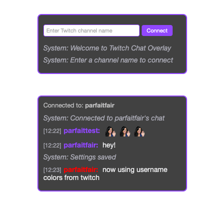

# TwitchLite Overlay

A lightweight, customizable Twitch chat overlay for streamers using OBS or other broadcasting software.

[Click here for a live demo!](https://detekoi.github.io/compact-chat-overlay/)

## Features

- **Compact & Clean Interface**: Displays chat messages in a minimalist window that can be added as a browser source.
- **Native Twitch or Custom Colors**: Uses each chatter's original Twitch username colors.
- **Emote Support**: Displays Twitch emotes in chat.
- **Customizable Appearance**:
  - Background color & opacity
  - Border color
  - Text color
  - Font size
  - Window width
  - Usernames - use original Twitch colors or pick a custom color
- **Draggable Interface**: Position the chat window anywhere on your screen or in OBS.
- **Auto-Connect**: Remembers your channel and automatically connects on startup.
- **No Authentication Required**: Works anonymously without needing Twitch credentials.

## How to Use

### Adding to OBS

1. Download this repository or clone it to your computer.
2. In OBS Studio, add a new "Browser Source" to your scene.
3. Select "Local file" and browse to the `index.html` file.
4. Set the width and height (recommended starting size: 320px × 600px).
5. Click "OK" to add the source.

### Configuring the Overlay

1. When first loaded, enter your Twitch channel name in the input field and click "Connect".
2. Access settings by hovering over the chat window and clicking the gear icon (⚙️).
3. Customize the appearance using the available options.
4. Click "Save Settings" to apply your changes.

### Settings Options

- **Background**: Adjust color and opacity
- **Border**: Change the border color
- **Text**: Set the message text color
- **Font Size**: Adjust the text size
- **Width**: Change the width of the chat window
- **Max Messages**: Control how many chat messages to show before removing older ones
- **Show Timestamps**: Toggle message timestamps
- **Theme**: Choose between Default or Polar Bear Cafe theme presets

## Customization Tips

- For a transparent background, reduce the opacity slider to 0.
- For better readability, keep font sizes between 12-16px.
- Position the chat overlay where it won't overlap with important game elements.

## Technical Details

- Built with pure HTML, CSS, and JavaScript.
- Uses WebSocket to connect to Twitch's IRC service.
- No external libraries or dependencies required.
- Settings are saved to your browser's localStorage.

## Issues & Limitations

- The overlay requires an internet connection to function.
- Very high chat volume might cause performance issues on older systems.
- Some custom/BTTV/FFZ emotes are not supported (only standard Twitch emotes).

## License

MIT License - Feel free to modify and use as needed.

## Acknowledgements

- Default theme inspired by the visual style of Polar Bear Cafe anime
- Built for streamers who want a clean, customizable chat overlay

## Support & Contributions

If you find this useful or have suggestions for improvements, feel free to:
- Star the repository
- Submit issues or pull requests
- Fork and customize it for your own needs